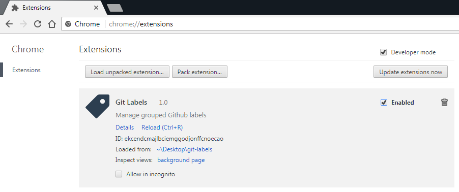

Git Labels
==========


Git Labels is a google chrome extension that help users better manage grouped labels within their Github repository. This extension helps organize labels into different groups and restricts user's selection of labels based on label group exclusivity rules. It currently supports three different label group types and they are dot, dashed and non-grouped.

## Getting Started

These instructions will get you a copy of the project and run it as a Google Chrome Extension within Google Chrome on your local machine. See wiki for this project's developer notes.

### Prerequisites

```
Google Chrome 56.0.2924 or above with javascript enabled
```

### Installation

1. **Download Git Labels**

    Download a copy ([https://github.com/jiajunGit/Git-Labels/archive/master.zip](https://github.com/jiajunGit/Git-Labels/archive/master.zip)) of the project onto your local machine and unzip its contents. Ensure that the root structure of your folder is as shown below:

    

2. **Navigate to Chrome Extensions**

    Navigate to [chrome://extensions/](chrome://extensions/) in Google Chrome

3. **Enable Developer Mode**

    Tick on the checkbox with the words "Developer mode" on its right

    

4. **Load unpacked extension**

    Click on the "Load unpacked extension..." button and select the folder containing the project. Ensure that after loading the extension, your Google Chrome extension page has an entry for Git Labels as shown below:

    
